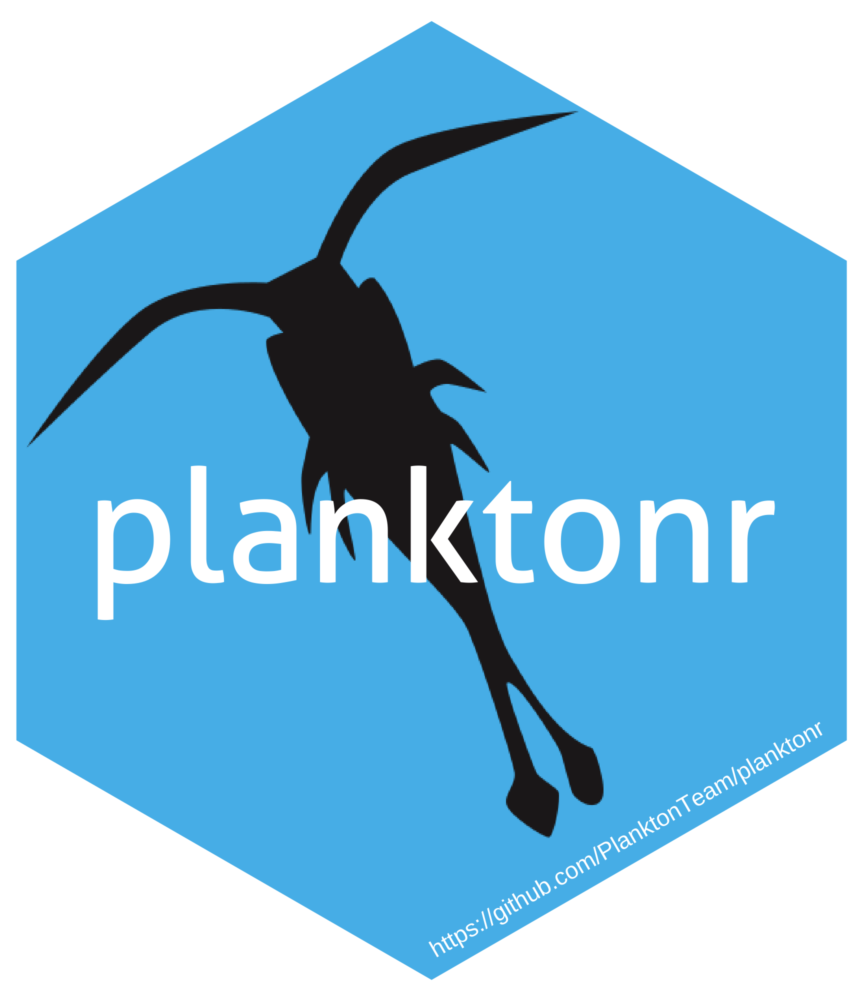

<!-- README.md is generated from README.Rmd. Please edit that file -->

```{r, include = FALSE}
knitr::opts_chunk$set(
  collapse = TRUE,
  comment = "#>",
  fig.path = "man/figures/README-",
  out.width = "100%"
)
```

# planktonr <a href="https://github.com/PlanktonTeam/planktonr"></a>

<!-- badges: start -->
[](https://lifecycle.r-lib.org/articles/stages.html#experimental)
[](https://github.com/PlanktonTeam/planktonr/actions/workflows/Windows.yaml)
[](https://github.com/PlanktonTeam/planktonr/actions/workflows/Ubuntu.yaml)
[](https://github.com/PlanktonTeam/planktonr/actions/workflows/MacOS.yaml)
[](https://app.codecov.io/gh/PlanktonTeam/planktonr?branch=main)
[](https://github.com/PlanktonTeam/planktonr/issues)
<!-- badges: end -->

`planktonr` is an R package that facilitates the download, analysis, and visualisation of phytoplankton and zooplankton data. The package primarily focuses on plankton data from the Australian Ocean Data Network ([AODN](https://portal.aodn.org.au)) collected by the Integrated Marine Observing System ([IMOS](https://www.imos.org.au)), including:

* **National Reference Stations (NRS)** - Coastal monitoring stations with monthly sampling
* **Continuous Plankton Recorder (CPR)** - Ship-based transect sampling across ocean basins  
* **Southern Ocean Time Series (SOTS)** - Deep ocean mooring south of Tasmania

The package provides access to phytoplankton, zooplankton, larval fish, and biogeochemical data, along with tools for trend analysis, biodiversity assessment, and data visualisation.

## Installation

The package is under active development. You can install the development version from [GitHub](https://github.com/) with:

``` r
# install.packages("devtools")
devtools::install_github("PlanktonTeam/planktonr")
```

Some optional features require additional packages:
``` r
# For satellite data access
install.packages("thredds")

# For parallel processing (speeds up large data downloads)
install.packages(c("future", "furrr"))

# For community analysis functions
install.packages("vegan")
```

## Quick Start

```{r, eval=FALSE}
library(planktonr)
library(dplyr)
library(ggplot2)

# Get zooplankton biomass from NRS stations
df <- pr_get_Indices("NRS", "Zooplankton") %>%
  filter(Parameters == "Biomass_mgm3", 
         StationCode %in% c("MAI", "PHB"))

# Plot time series
pr_plot_TimeSeries(df, trans = "log10")

# Examine long-term trends
pr_plot_Trends(df, Trend = "Raw", method = "lm", trans = "log10")

# Look at seasonal patterns
pr_plot_Trends(df, Trend = "Month", method = "loess", trans = "log10")
```

## Key Features

### Data Access
* **`pr_get_NRSData()`** - Raw taxonomic data from NRS stations
* **`pr_get_CPRData()`** - Raw taxonomic data from CPR surveys
* **`pr_get_Indices()`** - Pre-calculated ecological indices (biomass, diversity, abundance)
* **`pr_get_FuncGroups()`** - Functional group abundance (diatoms, copepods, etc.)
* **`pr_get_NRSChemistry()`** - Nutrient and carbon chemistry data
* **`pr_get_NRSPigments()`** - Photosynthetic pigment concentrations

### Visualisation
* **`pr_plot_TimeSeries()`** - Basic time series plots
* **`pr_plot_Trends()`** - Time series with fitted trend lines
* **`pr_plot_Climatology()`** - Seasonal and annual climatologies
* **`pr_plot_tsfg()`** - Functional group composition over time
* **`pr_plot_EOVs()`** - Essential Ocean Variable plots for reporting

### Analysis
* **`pr_remove_outliers()`** - Statistical outlier detection and removal
* **`pr_add_Bioregions()`** - Assign samples to Australian marine bioregions
* **`pr_filter_data()`** - Helper for filtering datasets for analysis

## Learn More

See the package vignettes for detailed examples:
* `vignette("planktonr")` - Overview and sampling frequency maps
* `vignette("EssentialOceanVariables")` - EOV analysis and reporting
* `vignette("Phytoplankton")` - Phytoplankton data analysis examples
* `vignette("Zooplankton")` - Zooplankton data analysis examples
* `vignette("Biogeochemistry")` - Nutrient and pigment data
* `vignette("LarvalFish")` - Larval fish distribution data

## Acknowledgements

This package accesses data from the Integrated Marine Observing System (IMOS). IMOS is enabled by the National Collaborative Research Infrastructure Strategy (NCRIS) and is supported by the Australian Government.

Thanks to the Integration and Application Network ([ian.umces.edu/media-library](https://ian.umces.edu/media-library)) for the plankton symbols used in the planktonr hex sticker.
