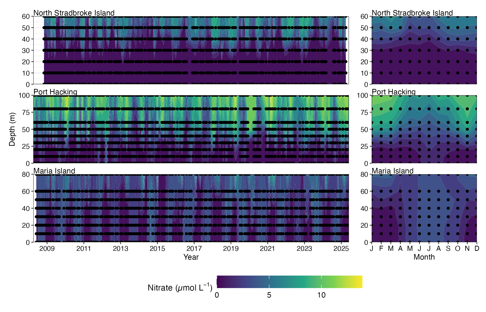
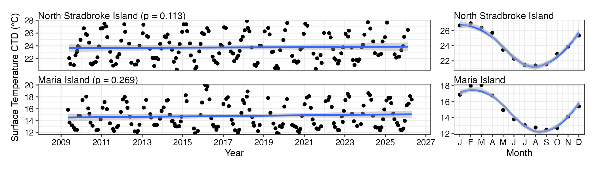
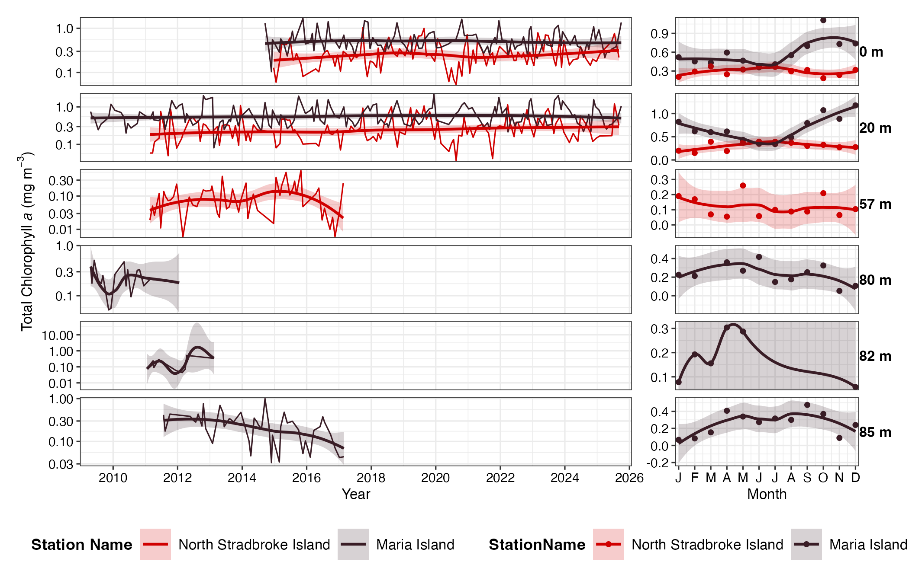
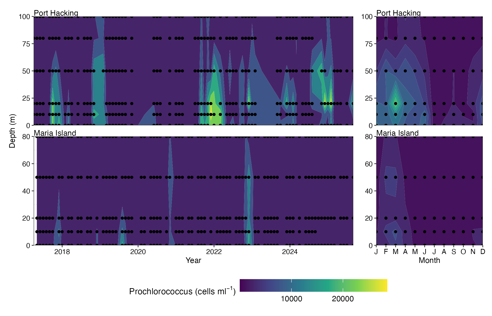

# 6. Biogeochemistry

``` r

library(planktonr)
library(dplyr)
library(tidyr)
library(ggplot2)
library(patchwork)
```

#### Nutrients at National Reference Stations

Explore the data and see what parameters are available for plotting at
which stations. Note that Oxygen data is only available for Maria Island
and Rottnest Island.

``` r

Nuts <- pr_get_NRSEnvContour("Chemistry") 
unique(Nuts$Parameters)
#>  [1] "Silicate_umolL"    "Phosphate_umolL"   "Ammonium_umolL"   
#>  [4] "Nitrate_umolL"     "DIC_umolkg"        "Alkalinity_umolkg"
#>  [7] "Salinity"          "NOx_umolL"         "DIN_umolL"        
#> [10] "Redfield"          "Nitrite_umolL"     "Oxygen_umolL"
unique(Nuts$StationName)
#>  [1] Darwin                  Esperance               Kangaroo Island        
#>  [4] Maria Island            Ningaloo                North Stradbroke Island
#>  [7] Port Hacking            Rottnest Island         Bonney Coast           
#> [10] Yongala                
#> 10 Levels: Darwin Yongala Ningaloo North Stradbroke Island ... Maria Island
```

Here we use a contour plot to visualise Nitrate at the east coast
stations. This function can be used with raw data, interpolated data and
with gap filled interpolated data. The maxgap attribute in only valid
when Fill_NA is true. The highest nitrate levels occur at depth in Port
Hacking and can be seen to be lowest in the winter months.

``` r


Nuts <- pr_get_NRSEnvContour("Chemistry") %>% 
  filter(StationCode %in% c("NSI", "PHB", "MAI")) %>% 
  filter(Parameters %in% "Nitrate_umolL") %>%
  mutate(name = as.factor(.data$Parameters)) %>% #TODO Check
  drop_na() 

pr_plot_NRSEnvContour(Nuts, na.fill = TRUE)
```



#### CTD data from National Reference Stations

Using “Water” in the pr_get_Indices function will get the parameters
associated with the water body at the time of sampling. The parameters
starting CTD are mean values over the top 10m of the water column.

``` r

CTD <- pr_get_Indices("NRS", "Water") 
unique(CTD$Parameters)
#> [1] "Secchi_m"            "MLDtemp_m"           "MLDsal_m"           
#> [4] "DCM_m"               "CTDTemperature_degC" "CTDSalinity_PSU"    
#> [7] "CTDChlaF_mgm3"
```

As you would expect if we plot the surface temperature at North
Stradbroke it is significantly warmer than that at Maria Island. Both
seem reasonably stable over the plotting period with very similar
seasonal trends.

``` r

CTD <- pr_get_Indices("NRS", "Water") %>% 
  filter(Parameters == "CTDTemperature_degC") %>% 
  filter(StationCode %in% c("NSI", "MAI"))

p1 <- pr_plot_Trends(CTD, Trend = "Raw", method = "lm", trans = "identity")
p2 <- pr_plot_Trends(CTD, Trend = "Month", method = "loess", trans = "identity") +
  ggplot2::theme(axis.title.y = ggplot2::element_blank())
p1 + p2 + plot_layout(widths = c(3, 1), guides = "collect")
```



## Pigments at National Reference Stations

The pigments are available as binned or raw. The binned version provides
the data as Totals of the major pigment components, the raw data is the
values of the individual pigments measured. The collection of pigments
has varied over the course of the sampling program, the surface and 20m
samples are the most consistently sampled. You may want to round the
depths for a neater plot.

``` r


Pigs <- pr_get_NRSPigments(Format = "binned") %>% 
  pr_remove_outliers(2) %>% 
  filter(Parameters == "TotalChla") %>% 
  filter(StationCode %in% c("NSI", "MAI"))

(p <- pr_plot_Enviro(Pigs, Trend = "Smoother", trans = "log10") & theme(legend.position = "bottom"))
```



## Picophytoplankton at National Reference Stations

The contour plots are a neat way to visualise the picoplankton from the
NRS stations. The data can be viewed as raw, interpolated or
interpolated with gap filling.

``` r


Pico <- pr_get_NRSEnvContour("Pico") %>% 
  dplyr::filter(Parameters %in% c("Prochlorococcus_cellsmL")) %>% 
  filter(StationCode %in% c("PHB", "MAI"))

pr_plot_NRSEnvContour(Pico, na.fill = TRUE)
```


