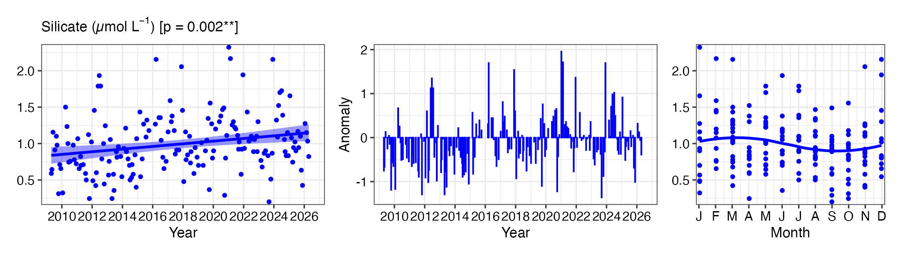
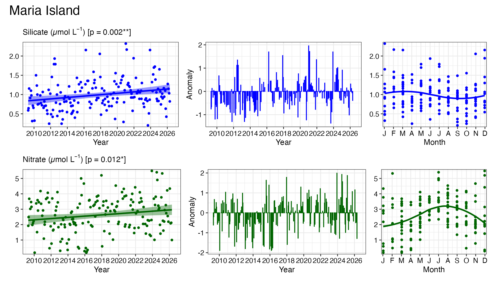
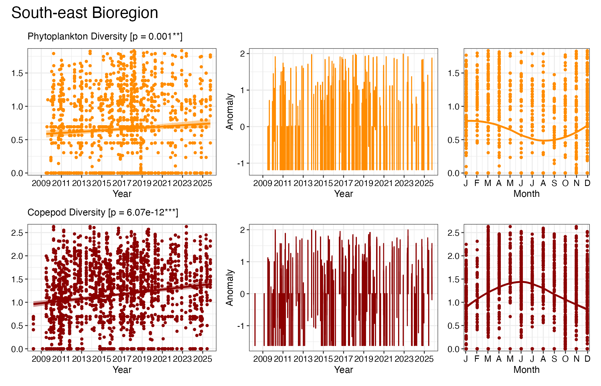
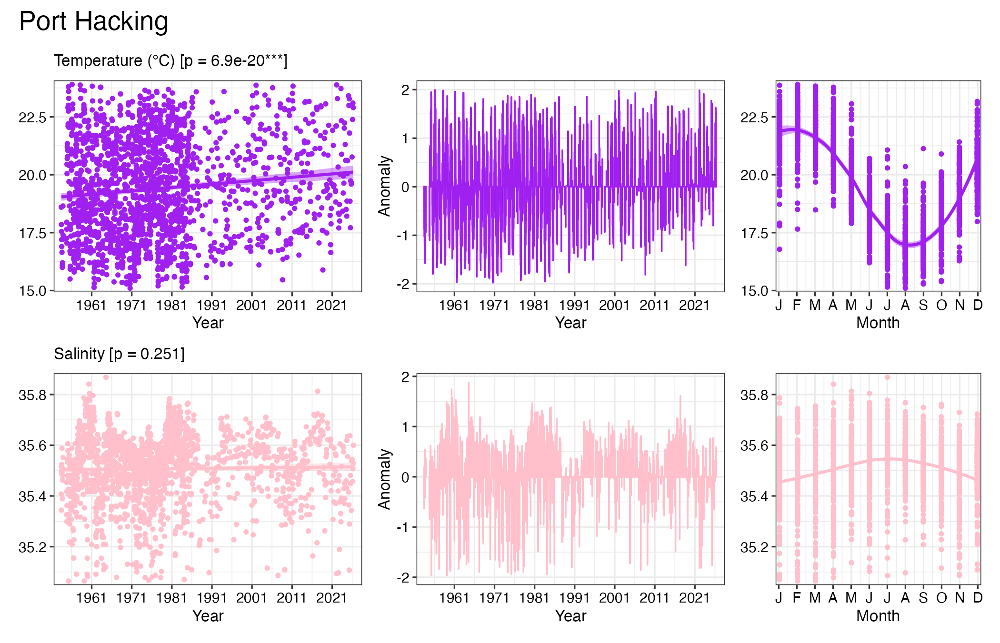

# 1. Essential Ocean Variables

``` r

library(planktonr)
library(dplyr)
library(ggplot2)
library(patchwork)
```

Biomass and diversity are the [Essential Ocean Variables (EOVs)](NA) for
plankton. These are the important variables that scientists have
identified to monitor our oceans. They are chosen based on impact of the
measurement and the feasiblity to take consistent measurements. They are
commonly measured by observing systems and frequently used in policy
making and input into reporting such as State of Environment.

## National Reference Stations

First we get the NRS EOV data and subset it for Maria Island and add the
trend coefficients using:

``` r

EOV <- planktonr::pr_get_EOVs(Survey = "NRS")

EOV_MAI <- EOV %>%
  filter(StationCode == "MAI") %>%
  pr_remove_outliers(2)
```

To see what EOVs are available for plotting at Maria Island, do:

``` r

unique(EOV_MAI$Parameters)
#>  [1] "Biomass_mgm3"            "PhytoBiomassCarbon_pgL" 
#>  [3] "ShannonCopepodDiversity" "ShannonPhytoDiversity"  
#>  [5] "Salinity"                "PigmentChla_mgm3"       
#>  [7] "Ammonium_umolL"          "Nitrate_umolL"          
#>  [9] "Silicate_umolL"          "Phosphate_umolL"        
#> [11] "CTDTemperature_degC"     "Oxygen_umolL"           
#> [13] "Nitrite_umolL"
```

Once we have chosen the EOV we are interested in, we can plot it as
below. Note the use of the `&` to apply the theme. This is because the
resulting figure is a patchwork of ggplots.

``` r

(p1 <- pr_plot_EOVs(EOV_MAI, EOV = "Silicate_umolL"))       
```



We can also add other EOVs to the patchwork.

``` r

p1 / pr_plot_EOVs(EOV_MAI, EOV = "Nitrate_umolL", col = "darkgreen") &
  plot_annotation(title = "Maria Island")
```



## Continuous Plankton Recorder

We can also do the same for bioregions using data from the Continuous
Plankton Recorder. In this instance, the data is structured as
bioregions.

``` r

EOV <- planktonr::pr_get_EOVs("CPR")
```

To see the bioregions and EOVs available we can look at the data

``` r

unique(EOV$BioRegion)
#> [1] South-east            None                  South-west           
#> [4] Southern Ocean Region Temperate East        Coral Sea            
#> 8 Levels: North North-west Coral Sea Temperate East South-east ... None
unique(EOV$Parameters)
#> [1] "BiomassIndex_mgm3"       "PhytoBiomassCarbon_pgm3"
#> [3] "ShannonCopepodDiversity" "ShannonPhytoDiversity"  
#> [5] "SST"                     "chl_oc3"
```

Filter the data for the required bioregion.

``` r

EOV_SE <- EOV %>%
  filter(BioRegion == "South-east") %>%
  pr_remove_outliers(2)
```

Now plot the data

``` r

pr_plot_EOVs(EOV_SE, EOV = "ShannonPhytoDiversity", col = "darkorange") / 
  pr_plot_EOVs(EOV_SE, EOV = "ShannonCopepodDiversity", col = "darkred") &
  plot_annotation(title = "South-east Bioregion")
```



## Long term monitoring

Sampling at Maria Island, Port Hacking and Rottnest Island begun prior
to IMOS. Here we plot the data for the long-term monitoring stations
only.

``` r

EOV <- planktonr::pr_get_EOVs("LTM")

EOV_PHB <- EOV %>%
  filter(StationCode == "PHB") %>%
  pr_remove_outliers(2)
```

To see what EOVs are available for plotting at Port Hacking LTM, do:

``` r

unique(EOV_PHB$Parameters)
#>  [1] "Phosphate_umolL"   "Oxygen_umolL"      "Salinity"         
#>  [4] "Temperature_degC"  "Nitrate_umolL"     "Silicate_umolL"   
#>  [7] "Ammonium_umolL"    "DIC_umolkg"        "Alkalinity_umolkg"
#> [10] "NOx_umolL"         "DIN_umolL"         "Redfield"         
#> [13] "Nitrite_umolL"
```

Do the plotting

``` r

pr_plot_EOVs(EOV_PHB, EOV = "Temperature_degC", col = "purple") / 
  pr_plot_EOVs(EOV_PHB, EOV = "Salinity", col = "pink") &
  plot_annotation(title = "Port Hacking")
```


