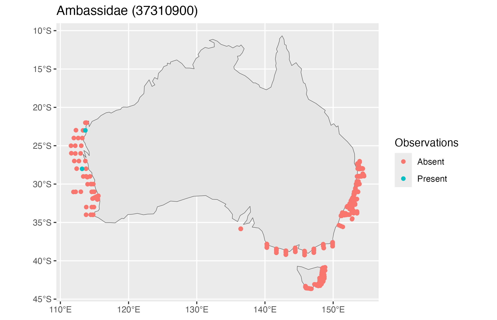

# 5. LarvalFish

``` r

library(planktonr)
library(ggplot2)
library(dplyr)
```

### Download Larval Fish Data

``` r

df <- pr_get_LFData()
```

Examine the first 20 species

``` r

head(unique(df$Species2), 20)
#>  [1] "Acanthuridae: Acanthuridae (37437900)"               
#>  [2] "Acropomatidae: Acropomatidae (37311956)"             
#>  [3] "Acropomatidae: Synagrops spp (37311949)"             
#>  [4] "Acropomatidae: Verilus anomalus (37311053)"          
#>  [5] "Ambassidae: Ambassidae (37310900)"                   
#>  [6] "Ambassidae: Ambassis jacksoniensis (37310012)"       
#>  [7] "Ambassidae: Ambassis marianus (37310018)"            
#>  [8] "Ammodytidae: Ammodytidae (37425000)"                 
#>  [9] "Ammodytidae: Ammodytoides spp (37425901)"            
#> [10] "Antennariidae: Antennariidae (37210915)"             
#> [11] "Aploactinidae: Aploactinidae (37290000)"             
#> [12] "Aploactinidae: Matsubarichthys inusitatus (37290013)"
#> [13] "Aplodactylidae: Aplodactylus lophodon (37376002)"    
#> [14] "Aplodactylidae: Aplodactylus spp (37376901)"         
#> [15] "Apogonidae: Apogonidae (37327926)"                   
#> [16] "Argentinidae: Argentinidae (37097905)"               
#> [17] "Arripidae: Arripidae (37344000)"                     
#> [18] "Arripidae: Arripis trutta (37344002)"                
#> [19] "Astronesthidae: Astronesthidae (37108000)"           
#> [20] "Atherinidae: Atherinidae (37246911)"
```

Filter the data for *Ambassidae* observations

``` r

df_Amb <- df %>% 
  filter(Species2 == "Ambassidae: Ambassidae (37310900)")
```

Plot the observations

``` r

# Convert the data to an sf object and set observations to present or Absent
df_sf <- df_Amb %>% 
  sf::st_as_sf(coords = c("Longitude", "Latitude"), crs = 4326) %>% 
  mutate(Observations = if_else(Abundance_1000m3 == 0 | is.na(Abundance_1000m3), "Absent", "Present"))

ggplot() + 
  geom_sf(data = rnaturalearth::ne_countries(country = "Australia", returnclass = "sf")) +
  geom_sf(data = df_sf, aes(colour = Observations)) + 
  ggtitle("Ambassidae (37310900)")
```


