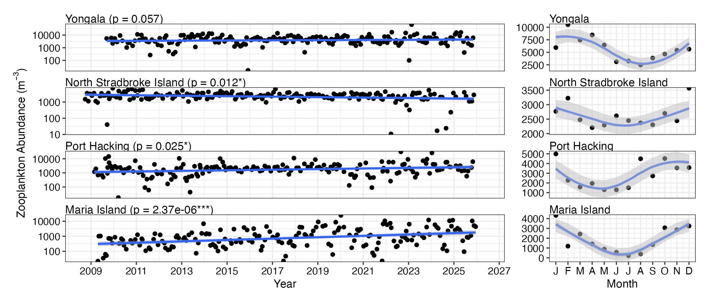
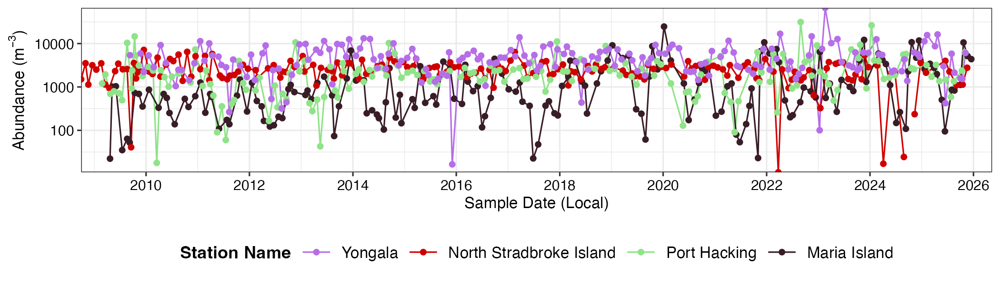
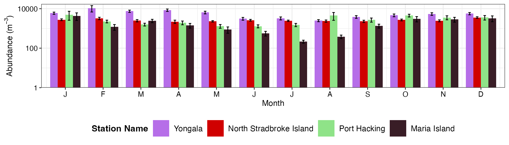
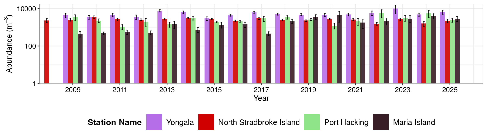
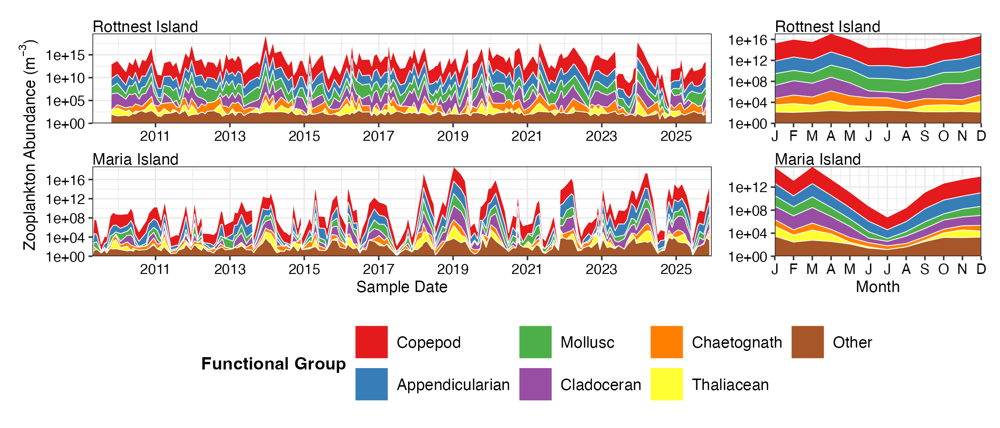
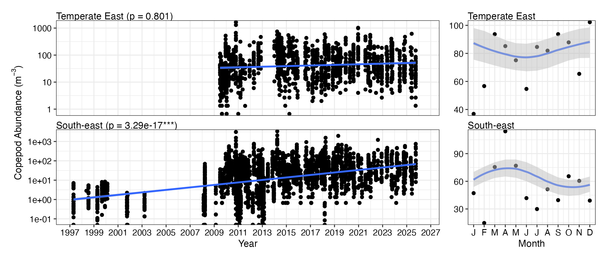
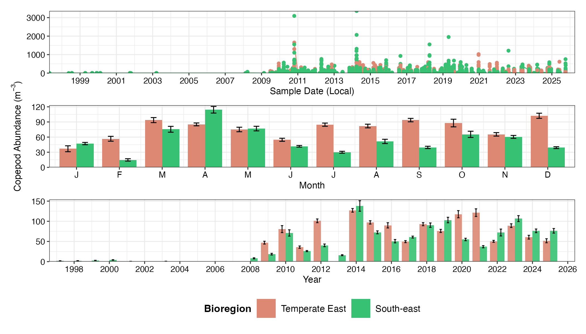
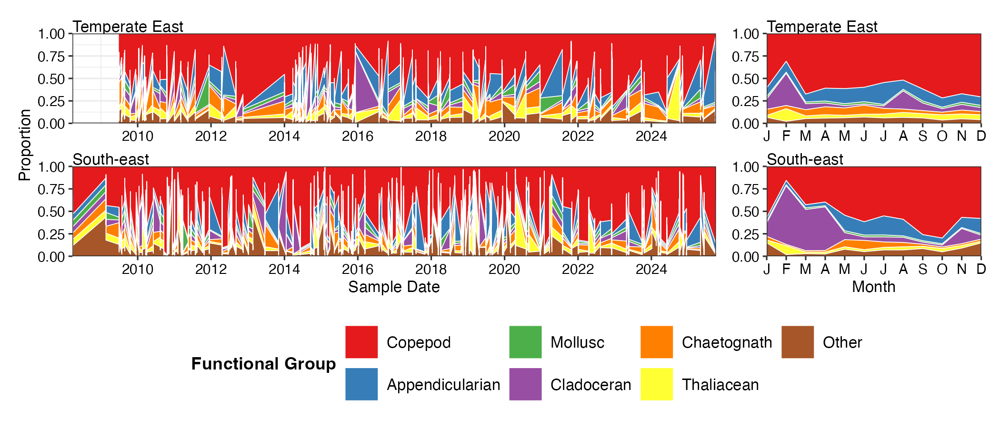

# 4. Zooplankton

``` r

library(planktonr)
library(dplyr)
library(ggplot2)
library(patchwork)
```

## National Reference Stations

Have a look at the file and see what is available for plotting, by
downloading the file you can inspect the parameters and the Stations
available.

``` r


NRSz <- planktonr::pr_get_Indices(Survey = "NRS", Type = "Zooplankton") 
unique(NRSz$Parameters)
#> [1] "Biomass_mgm3"                  "AshFreeBiomass_mgm3"          
#> [3] "ZoopAbundance_m3"              "CopeAbundance_m3"             
#> [5] "AvgTotalLengthCopepod_mm"      "OmnivoreCarnivoreCopepodRatio"
#> [7] "NoCopepodSpecies_Sample"       "ShannonCopepodDiversity"      
#> [9] "CopepodEvenness"
unique(NRSz$StationName)
#>  [1] Darwin                  Esperance               Kangaroo Island        
#>  [4] Maria Island            Ningaloo                North Stradbroke Island
#>  [7] Port Hacking            Rottnest Island         Bonney Coast           
#> [10] Yongala                
#> 10 Levels: Darwin Yongala Ningaloo North Stradbroke Island ... Maria Island
```

### Trend Analysis

Long term plankton monitoring can provide insights into how zooplankton
abundance and biomass are changing with time. This has implications for
the fish communities they support and the lower trophic levels on which
they depend for energy. Abundance and biomass trends don’t necessarily
show the same temporal trends, here we show zooplankton abundance by
time, but biomass can also be chosen as the parameter. Seasonal cycles
can also be important for understanding planktonic communities, for
examples in these plots it is clear that there is a much stronger
seasonal cycle at Maria Island in a temperate location than at Yongala,
a more tropical station.

``` r


NRSz <- planktonr::pr_get_Indices(Survey = "NRS", Type = "Zooplankton") %>% 
  filter(Parameters == "ZoopAbundance_m3") %>% 
  filter(StationCode %in% c("YON", "NSI", "PHB", "MAI"))

p1 <- planktonr::pr_plot_Trends(NRSz, Trend = "Raw", method = "lm", trans = "log10")
p2 <- planktonr::pr_plot_Trends(NRSz, Trend = "Month", method = "loess")

p1 + p2 + 
  ggplot2::theme(axis.title.y = ggplot2::element_blank()) + # Remove y-title from 2nd column
  plot_layout(widths = c(3, 1), guides = "collect")
```



### Climatologies

Here we plot the same information but change the format of the figures.

First we plot zooplankton abundance at the 4 east coast NRS stations
with log10 scaling.

``` r

(p1 <- planktonr::pr_plot_TimeSeries(NRSz, trans = "log10") +
   ylab(rlang::expr(paste("Abundance (m"^-3,")"))))
```



Then we can plot the same data as monthly means.

``` r

(p2 <- planktonr::pr_plot_Climatology(NRSz, Trend = "Month", trans = "log10") +
   ylab(rlang::expr(paste("Abundance (m"^-3,")"))))
```



And then as Annual means.

``` r

(p3 <- planktonr::pr_plot_Climatology(NRSz, Trend = "Year", trans = "log10") +
   ylab(rlang::expr(paste("Abundance (m"^-3,")"))))
```



### Functional Groups

We can also gain a lot of insight into the community structure by
looking at how the composition (or proportions) of the functional groups
changes over time, long term and seasonally. In this function we have
chosen some of the more important function groups and plotted them as a
time series and a seasonal cycle. Again you can see that Maria Island
demonstrates a strong seasonal pattern with lower abundances in all
groups during winter.

``` r


FGz <- pr_get_FuncGroups(Survey = "NRS", Type = "Zooplankton") %>% 
  dplyr::filter(StationCode %in% c("ROT", "MAI"))

p1 <- planktonr::pr_plot_tsfg(FGz, Scale = "Actual")
p2 <- planktonr::pr_plot_tsfg(FGz, Scale = "Actual", Trend = "Month") +
  ggplot2::theme(axis.title.y = element_blank())
      
p1 + p2 + 
  patchwork::plot_layout(widths = c(3,1), guides = "collect") & 
  theme(legend.position = "bottom")
```



## Continuous Plankton Recorder

Have a look at the file and see what is available for plotting, by
downloading the file you can inspect the parameters and the bioregions
available.

``` r


CPRz <- planktonr::pr_get_Indices(Survey = "CPR", Type = "Zooplankton") 
unique(CPRz$Parameters)
#> [1] "BiomassIndex_mgm3"             "ZoopAbundance_m3"             
#> [3] "CopeAbundance_m3"              "AvgTotalLengthCopepod_mm"     
#> [5] "OmnivoreCarnivoreCopepodRatio" "NoCopepodSpecies_Sample"      
#> [7] "ShannonCopepodDiversity"       "CopepodEvenness"              
#> [9] "PCI"
unique(CPRz$BioRegion)
#> [1] South-east            None                  South-west           
#> [4] Southern Ocean Region North-west            North                
#> [7] Temperate East        Coral Sea            
#> 8 Levels: North North-west Coral Sea Temperate East South-east ... None
```

### Trend Analysis

Here we can compare the long term time series copepod abundance data for
the South-east and Temperate-east areas of Australia. Due to way the CPR
data is collected this is easier to visualise in a regional context.
There is not a noticeable difference in the abundance of copepods in
these two regions from the plots but again you can see that the seasonal
cycle is more distinct in the South-east.

``` r


CPRz <- planktonr::pr_get_Indices(Survey = "CPR", Type = "Zooplankton") %>% 
  filter(Parameters == "CopeAbundance_m3") %>% 
  filter(BioRegion %in% c("South-east", "Temperate East"))

p1 <- planktonr::pr_plot_Trends(CPRz, Trend = "Raw", method = "lm", trans = "log10")
p2 <- planktonr::pr_plot_Trends(CPRz, Trend = "Month", method = "loess")

p1 + p2 + 
  ggplot2::theme(axis.title.y = ggplot2::element_blank()) + # Remove y-title from 2nd column
  patchwork::plot_layout(widths = c(3, 1), guides = "collect")
```



### Climatologies

Plotting the same data as climatologies can provide another way to
visualise the differences between sampling regions.

``` r


p1 <- planktonr::pr_plot_TimeSeries(CPRz, trans = "identity") + theme(legend.position = "none", axis.title.y = element_blank())

p2 <- planktonr::pr_plot_Climatology(CPRz, Trend = "Month", trans = "identity") + theme(legend.position = "none")

p3 <- planktonr::pr_plot_Climatology(CPRz, Trend = "Year", trans = "identity") + theme(legend.position = "bottom", axis.title.y = element_blank())

wrap_plots(p1, p2, p3, ncol = 1)
```



### Functional Groups

If we look at way the proportion of different functional groups varies
over time we can see that copeopds, red, dominate the plankton in both
areas, especially towards the end of winter, and that there is a notable
bloom period of cladocerans in the South-east over the summer months.

``` r


FG <- pr_get_FuncGroups(Survey = "CPR", Type = "Zooplankton") %>% 
  filter(BioRegion %in% c("South-east", "Temperate East"))

p1 <- planktonr::pr_plot_tsfg(FG, Scale = "Proportion")
p2 <- planktonr::pr_plot_tsfg(FG, Scale = "Proportion", Trend = "Month") +
  ggplot2::theme(axis.title.y = element_blank())
      
p1 + p2 + 
  patchwork::plot_layout(widths = c(3,1), guides = "collect") & 
  theme(legend.position = "bottom")
```


